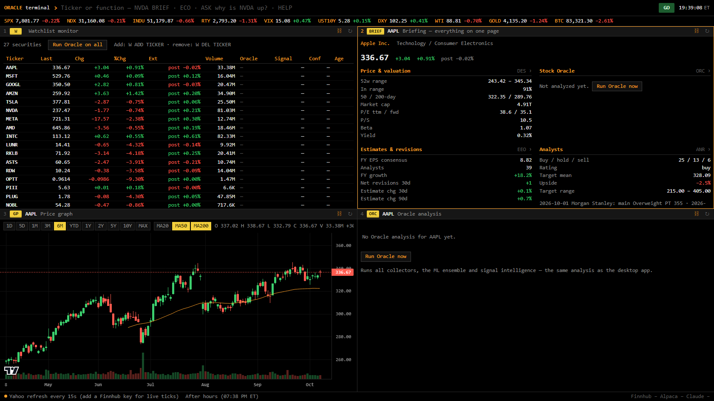

# Stock Oracle

A multi-signal stock prediction and monitoring system for Windows: 39 data collectors, an ML ensemble and an optional Claude advisor behind a tkinter desktop app, plus a Bloomberg-style browser terminal for research.

[](https://github.com/jamesccupps/StockOracle/actions/workflows/tests.yml)


## Features

- **Oracle Terminal** — a Bloomberg-style browser terminal: SEC filings, insider trades, holders, estimate revisions, short data, options, FRED macro, the yield curve and Oracle's signals, all a typed command away (see below)
- **39 Signal Collectors** (36 weighted, 3 disabled) — Technical analysis, news sentiment, SEC filings, Reddit/HackerNews sentiment, analyst ratings, insider trades, macro indicators, and more
- **Real-Time Monitoring** — Continuous scanning with live prices, intraday trend tracking, and automatic prediction verification
- **Machine Learning** — Ensemble ML (Random Forest, Gradient Boost, Neural Net) that trains on verified predictions and improves over time
- **Signal Intelligence** — Automatically detects and suppresses stale/constant signals, adapts conviction thresholds per ticker volatility, and adjusts for market hours vs after-hours
- **Market Regime Detection** — Identifies broad market selloffs/rallies from SPY + sector breadth and shifts all predictions accordingly
- **Breakout Scanner** — Scores stocks 0-100 on breakout probability using 8 technical patterns with estimated timeframes
- **News Feed** — Finnhub-powered per-stock and watchlist-wide news with recency weighting (breaking news counts 3x) and clickable article links
- **Claude AI Advisor** — Optional Anthropic API integration for periodic weight adjustments, pattern detection and session reviews, under a hard monthly spending cap shared by the GUI and the terminal
- **Built-in Help Guide** — 8-section help system explaining every feature

## Quick Start

### Option 1: One-Click Install (Windows)

1. Download or clone this repository
2. Double-click `INSTALL.bat`
3. Follow the prompts — it installs Python dependencies and creates shortcuts
4. Launch from Desktop shortcut or Start Menu

### Option 2: Manual Setup

```bash
git clone https://github.com/jamesccupps/StockOracle.git
cd StockOracle
pip install -r stock_oracle/requirements.txt
python -m stock_oracle
```

### Option 3: Build Standalone .exe

```bash
# After cloning and installing dependencies:
BUILD.bat
# Output: dist/StockOracle/StockOracle.exe (no Python needed to run)
```

The build bundles source files only. Your `stock_oracle/.env`, `data/`, `cache/` and `models/` stay out, and the script refuses to finish if any of them turn up in `dist`. A frozen build keeps its data in `%APPDATA%\StockOracle`.

## Oracle Terminal

A keyboard-driven market terminal in your browser, built on the same engine, data folder and keys as the desktop app.



```bash
python -m stock_oracle.terminal          # or double-click TERMINAL.bat  ->  opens http://127.0.0.1:8765/?token=...
python -m stock_oracle.terminal --lan    # also reachable from your phone over Tailscale/LAN
python -m stock_oracle.terminal.selftest # checks every data source with your keys
```

Type a ticker to load it into every linked panel, then a function code. `NVDA BRIEF`, `NVDA CF`, `GP 1Y`, `ECO`, `ASK why is LUNR bearish?`. `HELP` lists everything; typing anywhere goes to the command line.

| Function | What it shows | Source |
|---|---|---|
| `BRIEF` | Everything below on one page, plus Oracle's verdict | all |
| `GP` `HP` | Candlestick chart with MAs (live intraday bars), price table | Yahoo + live stream |
| `DES` `FA` | Profile, valuation, annual/quarterly statements | Yahoo |
| `EEO` | Consensus EPS/revenue and 7/30/90-day estimate revisions | Yahoo |
| `ANR` `EE` | Ratings, targets, upgrades/downgrades; earnings history and next date | Yahoo, Finnhub |
| `INS` `HDS` | Insider buys/sales (Form 4), institutional and fund holders (13F) | Yahoo |
| `CF` | SEC filings: 8-K items, 10-Q/K, Form 4/144, 13D/G, S-3/424B offerings | SEC EDGAR |
| `SI` | Short interest, days to cover, daily off-exchange short-volume ratio | Yahoo, FINRA |
| `DVD` `HOLD` | Dividend history and growth; ETF holdings, sectors, expense ratio | Yahoo |
| `OMON` `RV` `N` | Option chain with put/call ratios; peer valuation table; company news | Yahoo, Finnhub |
| `W` | Watchlist with live quotes and Oracle verdicts (shares the GUI's watchlist) | stream + Oracle |
| `ORC` `REG` `BRK` `ACC` | Oracle analysis (run on demand), regime, breakout scanner, accuracy | Stock Oracle |
| `ECO` `GC` | 24 FRED series (inflation, jobs, GDP, credit spreads, stress); Treasury curve vs 1m/1y | FRED |
| `MOST` `EVTS` `TOP` | Movers and screens; watchlist earnings calendar; market news | Yahoo, Finnhub |
| `WEI` `SECT` `GOVT` `FX` `CMDTY` `CRYPTO` | Cross-asset monitors with sparklines | Yahoo |
| `ASK` | Claude, with a live briefing on the focused ticker and the macro backdrop attached | Anthropic |

**Live prices.** With a Finnhub key the terminal streams trades over Finnhub's websocket (free tier: 50 symbols); with Alpaca keys and no Finnhub key it uses Alpaca's IEX feed (30 symbols). Without either, quotes refresh from Yahoo every 15 seconds. Indices, futures and FX always come from the Yahoo poll.

**Oracle integration.** `ORC` and `RUN` call the same `StockOracle.analyze()` as the GUI (predictions are recorded and verified the same way). The watchlist shows the newest verdict from either the terminal or the GUI's current monitoring session, so you can monitor in the GUI and read the results in the terminal. `ASK` uses the GUI's Claude settings and monthly spending cap.

**Settings** (optional, in `stock_oracle/.env`): `SEC_USER_AGENT` (SEC wants a real contact email), `TERMINAL_STREAM=auto|finnhub|alpaca|off`, `TERMINAL_FINNHUB_RPM` (default 30, leaving headroom for the GUI on the same key), `TERMINAL_POLL_SECONDS`, `TERMINAL_PREPOST=1` for extended-hours bars, `TERMINAL_TOKEN`, `TERMINAL_PORT`.

**Access token.** Every browser needs the token once: open the URL the console prints (it ends in `?token=...`) and a cookie remembers it for 90 days. This applies on localhost too, because otherwise any web page you visit could send requests to `127.0.0.1` (CSRF) or reach it through DNS rebinding. The token is generated on first run and kept in `stock_oracle/data/terminal_token.txt`; set `TERMINAL_TOKEN` to choose your own, or delete the file to rotate it.

## Configuration

1. Copy `.env.example` to `stock_oracle/.env`
2. Add your API keys (all optional, but Finnhub is recommended for real-time prices):

| Key | Source | Cost | What it enables |
|-----|--------|------|-----------------|
| Finnhub | [finnhub.io](https://finnhub.io/register) | Free | Real-time prices, company news |
| Alpaca | [alpaca.markets](https://alpaca.markets) | Free | Live quote stream in the terminal (IEX feed) when there's no Finnhub key |
| Anthropic | [console.anthropic.com](https://console.anthropic.com) | ~$5/mo | Claude AI advisor and the terminal's `ASK` (default model Haiku 4.5, cap set by `CLAUDE_MONTHLY_CAP`) |
| FRED | [fred.stlouisfed.org](https://fred.stlouisfed.org) | Free | Economic indicators |
| News API | [newsapi.org](https://newsapi.org) | Free | News sentiment |
| Reddit | [reddit.com/prefs/apps](https://www.reddit.com/prefs/apps) | Free | Social sentiment |
| SEC EDGAR | Just your email | Free | Filing analysis |
| GitHub | [github.com/settings/tokens](https://github.com/settings/tokens) | Free | Avoids rate limits |

Or skip all of this — the Settings dialog in the app lets you add keys through the GUI. Saving there keeps any other keys already in `.env`, such as the `TERMINAL_*` options.

## Security notes

- Keys live in plain text in `stock_oracle/.env`, which is gitignored and excluded from builds. Treat that file like a password.
- Broker integration is read-only. `brokers.py` can stream quotes and read portfolios, but has no code path that places, changes or cancels an order, and a test enforces that.
- The terminal requires an access token even on localhost. Use `--lan` over Tailscale or another encrypted link; it serves plain HTTP.
- Finnhub REST calls send the key in a header rather than the URL (only the websocket, which requires it, puts it in the URL), and query-string keys such as FRED's are scrubbed from logged request errors.

## Screenshots

Desktop app:


## How It Works

### Signal Collection
Each scan pulls data from 39 collectors spanning technical indicators (RSI, MACD, Bollinger Bands), fundamental analysis (P/E, margins), news sentiment, social media, SEC filings, analyst ratings, and alternative data sources. Signals are combined using tiered weighting with intelligence adjustments.

### Signal Intelligence
The system learns which collectors actually produce changing signals vs static noise. Collectors that return the same value every scan (like cached analyst ratings) get suppressed. Only dynamic, real-time signals drive conviction calls.

### Market Regime
Before predicting individual stocks, the system checks SPY, sector ETFs, and market breadth to detect broad selloffs or rallies. In a selloff, all predictions shift bearish — because when the whole market drops, individual stock signals don't matter much.

### Prediction Verification
Every prediction is recorded and verified against actual price movement (intraday: 3 scans later, 5-day: after horizon passes). Verified outcomes feed back into ML training, creating a learning loop.

### Accuracy caveats
Read the accuracy numbers with these in mind:
- Cross-validation runs on distinct samples only and logs a majority-class baseline next to each model; a score that doesn't beat the baseline means nothing.
- Historical training rows are still ordered by ticker rather than date, so the time-series split is optimistic.
- Intraday (±0.3%) and 5-day (±2%) outcomes share the same three classes.
- Monitoring isn't limited to market hours. While the market is closed prices barely move, which flatters NEUTRAL calls.

### Breakout Scanner
Scores stocks on 8 technical breakout patterns (Bollinger squeeze, volume accumulation, 52-week high proximity, RSI momentum, MACD crossover, MA alignment, range compression, relative strength) with estimated timeframes.

## Project Structure

```
StockOracle/
├── INSTALL.bat                    # One-click installer
├── START.bat                      # Quick launcher
├── BUILD.bat                      # PyInstaller build script
├── TERMINAL.bat                   # Oracle Terminal launcher
├── .env.example                   # API key template
├── stock_oracle/
│   ├── __main__.py                # Entry point
│   ├── config.py                  # Configuration & signal weights
│   ├── oracle.py                  # Main orchestrator
│   ├── gui.py                     # Desktop GUI (tkinter)
│   ├── signal_intelligence.py     # Stale signal detection & adaptive thresholds
│   ├── market_regime.py           # Broad market selloff/rally detection
│   ├── breakout_detector.py       # Breakout probability scanner
│   ├── news_feed.py               # News aggregation & display
│   ├── claude_advisor.py          # Anthropic Claude AI integration + shared spend cap
│   ├── brokers.py                 # Webull/Robinhood connectors (read-only)
│   ├── session_tracker.py         # Intraday monitoring & verification
│   ├── prediction_tracker.py      # 5-day prediction recording & scoring
│   ├── narrative.py               # Human-readable prediction summaries
│   ├── terminal/                  # Oracle Terminal (FastAPI + browser front end)
│   │   ├── server.py              # REST endpoints + /ws live quotes
│   │   ├── providers/             # Yahoo, Finnhub, SEC EDGAR, FINRA, FRED
│   │   ├── quotes.py              # Live quote hub (websocket stream + polling)
│   │   ├── oracle_bridge.py       # Oracle analysis, accuracy, regime, breakouts, Claude
│   │   ├── dossier.py             # BRIEF pages and ASK context
│   │   └── static/                # Front end (no build step)
│   ├── ml/
│   │   └── pipeline.py            # ML ensemble (RF, GBM, NN)
│   ├── collectors/
│   │   ├── base.py                # Base collector with caching
│   │   ├── yahoo_finance.py       # Price data & technicals
│   │   ├── finnhub_collector.py   # Real-time quotes & analyst data
│   │   ├── realtime_news.py       # Breaking news signal (15min cache)
│   │   ├── analysis.py            # RSI, MACD, Bollinger, MA crossovers
│   │   ├── advanced_signals.py    # Supply chain, patents, app store
│   │   ├── alt_data.py            # News, shipping, sentiment
│   │   ├── creative_signals.py    # Wikipedia, energy, cardboard index
│   │   ├── new_indicators.py      # Fear/greed, momentum, insider ratio
│   │   ├── cross_stock.py         # Peer correlation & earnings contagion
│   │   └── ...
│   ├── .env                       # Your keys/settings, written by the Settings dialog (gitignored)
│   └── data/                      # Generated at runtime (gitignored)
│       ├── predictions/           # Pending & verified predictions
│       ├── sessions/              # Monitoring session data
│       ├── gui_watchlist.json     # Watchlist shared by the GUI and the terminal
│       ├── claude_usage.json      # Monthly Claude spend
│       └── terminal_token.txt     # Terminal access token
├── tests/                         # pytest suite
├── docs/                          # README images
└── .github/workflows/tests.yml    # CI: Windows, Python 3.11-3.13
```

## Watchlist

Edit the `WATCHLIST` in `config.py` or add/remove tickers through the GUI. The default list includes major tech, space, and ETF tickers. The system handles 50-60 tickers comfortably.

## Tests

```bash
pip install -r stock_oracle/requirements.txt pytest
python -m pytest -q
```

GitHub Actions runs the suite on Windows with Python 3.11, 3.12 and 3.13 (`.github/workflows/tests.yml`).

## Disclaimer

**This is a research and educational tool. It is NOT financial advice.** No algorithm can predict the stock market with certainty. Past performance does not guarantee future results. Always do your own research and consult a financial advisor before making investment decisions. Use at your own risk.

## License

MIT — see [LICENSE](LICENSE)
